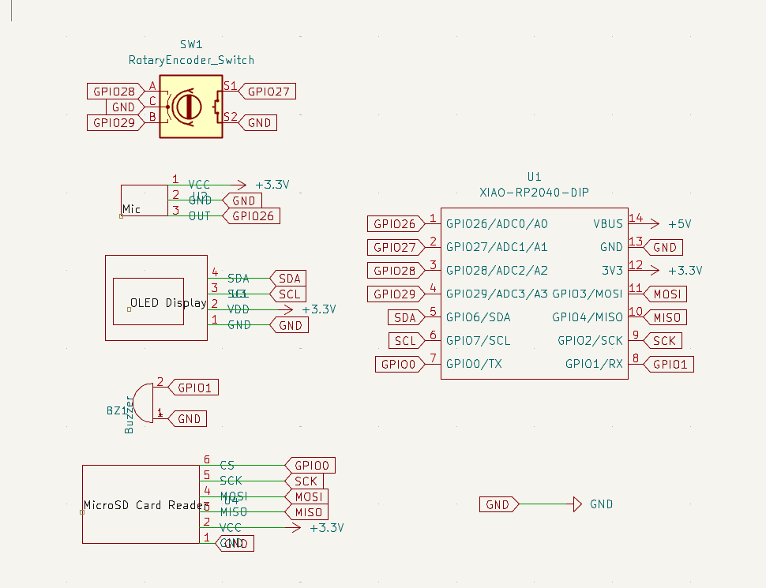
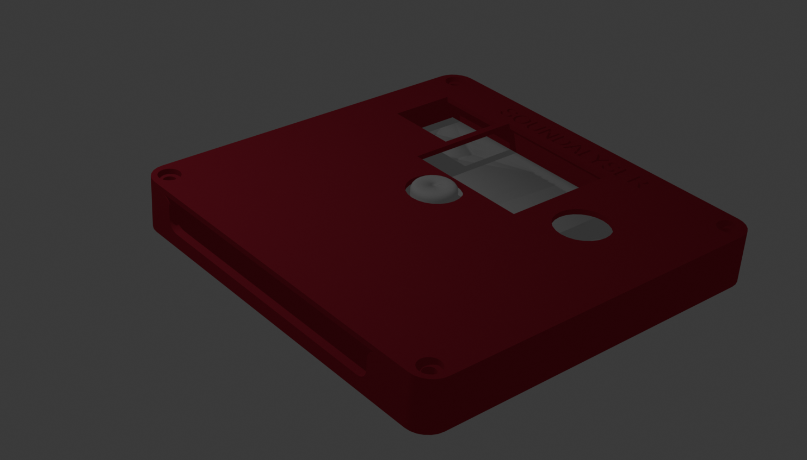

Total time spent: ~18 hours

# Day 1 (7/7) ~6 hours
Firstly I came up with the idea of the project, my idea was to make a small, portable noise detector.

Next, I researched different microphone, buzzer, oled and sd card modules and found some on aliexpress. Decided to use a XIAO RP2040 from aliexpress as I have gained some experience with this microcontroller through the hackpad project. I looked at the datasheets of the components to find the connections and operating voltages and created a preliminary schematic in kicad which I then updated using custom symbols and labels to make it more organised and readable. Once this was completed, I went back and rechecked all of the chosen components and redraw the schematic to make it more readable. I also tried to find appropriate components for the components as i'm not very confident with complex smd soldering yet. Then i redrew the schematic by adding global labels (missing form last project) and arranging the components nicely

Next I routed the pcb, making sure that the traces aren't too close to avoid shorts. I decided on the arrangement of the components, putting the XIAO and SD card reader at the bottom of the board so they could both be easily accessed through a common spacing in the bottom of the case for convenient code upload and sd card access. I rerouted a few times and added some silkscreen for asthetics. I used a mixture of the hackpad tutorial and sensor documentation to setup the XIAO connections. I had to restart a few times as I made custom footprints based on the oled, sd card reader and mic datasheets as these weren't available in the default kicad library. I used the standard connector spacing (2.54mm) and 1mm holes (1.8mm pad) through which i'll solder the connectors. I used the component's datasheets to match up the pads on the footprint to the symbol pins, making sure they were the right way for the intended orientation of the component on the pcb. I used datasheets to make sure the footprint pad numbers matched the custom symbol pins and had to experiment with different footprints for each sensor
  
Here is the custom footprint I made foe the sd card reader. I did research into differen tcommonly used throughole sizes and found that about 1mm is best as it is small enough for a tight mechanical fit to make mounting the component easily but loose enough to allow solder to easily flow around the pin.
  
then I used the kicad 3d viewer to check how the silkscreen looked and updated/moved around things a couple of times, including combinging headphones and waveform silkscreen to make a kind of logo (right). I also made sure that no silkscreen was coverign througholes just in case this caused any problems during the pcb manufacturing process (apparently it should be fine but didnt want to take any chances.)

# Day 2 (8/7) ~10 hours

After finishing the PCB design I moved onto the case. As im not very experienced with fusion360, I used the hackpad tutorial as a base to design the case and imported the pcb into fusion360 to make cutouts for the encoder, microphone and buzzer. I also made a slit and filleted some of the edges for a cleaner look. I will print the lid and base of the case seperatly using my own 3d printer. I referred to the sd card reader specifications to set the depth of the extrusion for the slit to make sure the sd card would be accessible. The lid will be secured to the bottom using m3 bolts and i looked at the dimensions of the screws when making the holes to make sure they are consistent. I often had to go back and chnage the number/sizing of holes in the case as i fixed and updated footprints on the pcb, leadning to a cycle of iteration that resulted in the case below.
  
I attempted to make a nice render the project in blender as I will be printing it in a red colour. However, my laptop is not very powerful and I wan't able to get a render of all of the components together in the case. This was the first time I have used blender so I spent some time playing around and learning how to edit meshes, use modifiers and use edge loops and extrusions. I then restarted the CAD for the case a few times, making sure that the dimensions were all correct and redoing the fusion sketches using the dimensions and fillet tool. Additionally, I had to update the layout and sizing of the holes in the case to match the components after importing the pcb into fusion.
  

The final step in the design was writing the firmware which took ages. This was difficult to write as there is not yet any physical hardware to test it on and there is definetly at least a few undetected bugs which will be fixed once the hardware arrives. I started by writing base code that read data from each of the sensors and played a sound on the buzzer at regualr intervals. I then implemented the multi-screen system for which i had to do a lot of research online about the adafruit OLED library through various tutorials and docs. After coding the SD logging and autosleep logic I went through and rewrote the entire firmware to make it more modular and structured by seperating it into well defined functions for readability and to make it easier to debug on the actual hardware. I initialized all components in setup(), including a safety check for the OLED and SD card. If either wasn't detected, an error message would display (or in the case of OLED failure, halt the loop). In the loop i read sensor values from the microphone and used them to update stat variables such as maxSound, keep a sound buffer and activate the alert if the sound values are above 900. Every minuite if an SD card is available the program logs the current mic value to a csv file. If the file can’t be opened or the SD card isn’t detected an error is shown on-screen. I made sure to include lots of error handling to make it easy to debug if a certain component isnt soldered to the pcb properly as the uninitialized component is displayed in a custome error message on the oled screen. I then changed the code so that button presses are detected through interrupts to ensure they arent blocked by some other process such as the oled update. Although the code compiles, im expecting there to be some issues with SD reliability and screen rendering which ill debug on the physical hardware.

# MISC
Around 2 hours spent checking through everything, formatting the repo and submitting it. Makign sure it conforms to the submission requirements and everything is organised into different files and that the BOM is optimised with the cheapest components. Expanded the journal.

# Build-------------------------------------------------------------------------------------
TFirslty after receiving the parts I prototyped it out on a breadboard and incrementely tested the different parts to make sure they were working properly. I also did some debugging of the firmware, mainly fixing the handling of the stored sound history, the rendering of the waveform and sound bar pages, and the encoder logic.
  
Next I soldered all of the components onto the pcb, i first soldered the headers to the components using a breadboard as i havent gotten that comfortable with soldering yet, and retested (everything worked the same as the breadbaord prototype) so i cut the metal pins on the back to make the pcb more flat so it would fit in the case properly.  
  

Then I printed the case, my initial cad measurements were a bit off so I remodelled and reprinted the top plate so that all of the components fit through the slots, using measurements of the physical pcb. I dont own calipers so I had to go through 3 iterations of the top plate, using ruler measurements as it was difficult to measuree completely accurately. Here is the completed build.

