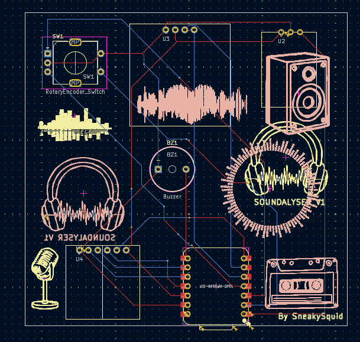
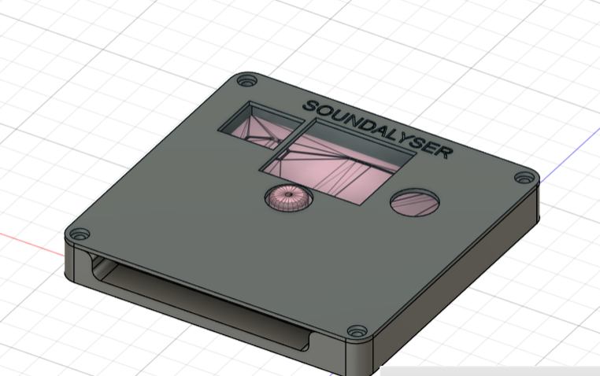

Total time spent: ~18 hours

# Day 1 (7/7) ~6 hours
Firstly I came up with the idea of the project, my idea was to make a small, portable noise detector.

Researched different mic, buzzer, oled and sd card modules and found some on aliexpress. I looked at the datasheets to find the connections and operating voltages and created a preliminary schematic in kicad which I then updated using custom symbols and labels to make it more organised and readable.

Next I routed the pcb, making sure that the traces aren't too close to avoid shorts. I decided on the arrangement of the components, putting the XIAO and SD card reader at the bottom so they could both be easily accessed through a common slit in the bottom of the case for code upload and sd card access. I rerouted a few times and added some silkscreen for asthetics. I had to restart a few times as I made custom footprints based on the oled, sd card reader and mic datasheets as these weren't available in the default kicad library. I used the standard connector spacing (2.54mm) and 1mm holes (1.8mm pad) through which i'll solder the connectors. I used the datasheets to match up the pads on the footprint to the symbol pins, making sure they were the right eay for the intended orientation of the component on the pcb.

# Day 2 (8/7) ~10 hours

After finishing the PCB design I moved onto the case. As im not very experienced with fusion360, I used the hackpad tutorial as a base to design the case and imported the pcb to make cutouts for the encoder, microphone and buzzer. I also made a slit and filleted some of the edges for a cleaner look. I will print the lid and base of the case seperatly. I referred to the sd card reader specifications to set th edepth of the extrusion for the slit to make sure the sd card would be accessible. The lid will be secured to the bottom using m3 bolts

I attempted to render the project in blender as I will be printing it in a red colour. However, my laptop is not very powerful and I wan't able to get a render of all of the components.

The final step in the design was writing the firmware which took ages. This was difficult to write as there is not yet any physical hardware to test it on and there is definetly at least a few undetected bugs which will be fixed once the hardware arrives. I started by writing base code that read data from each of the sensors and played a sound on the buzzer at regualr intervals. I then implemented the multi-screen system for which i had to do a lot of research online about the adafruit OLED library. After coding the SD logging and autosleep logic I went through and rewrote the wntire firmware to make it more modular and structured for readability and debugging on the actual hardware.

# MISC
Aroudn 2 hours spent checking through everything, formatting the repo and submitting it.