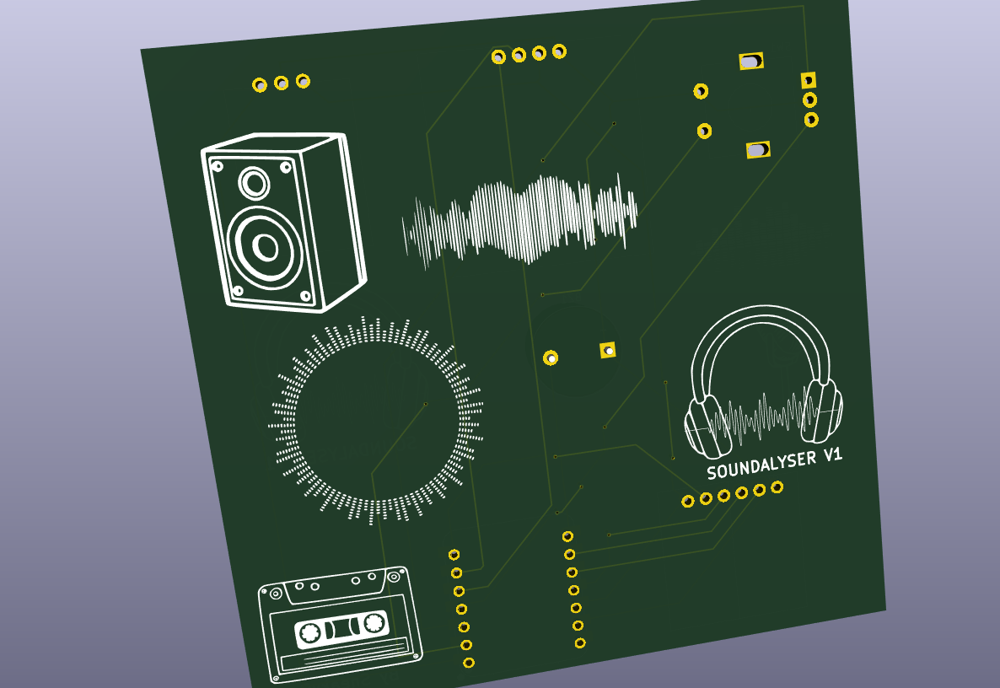
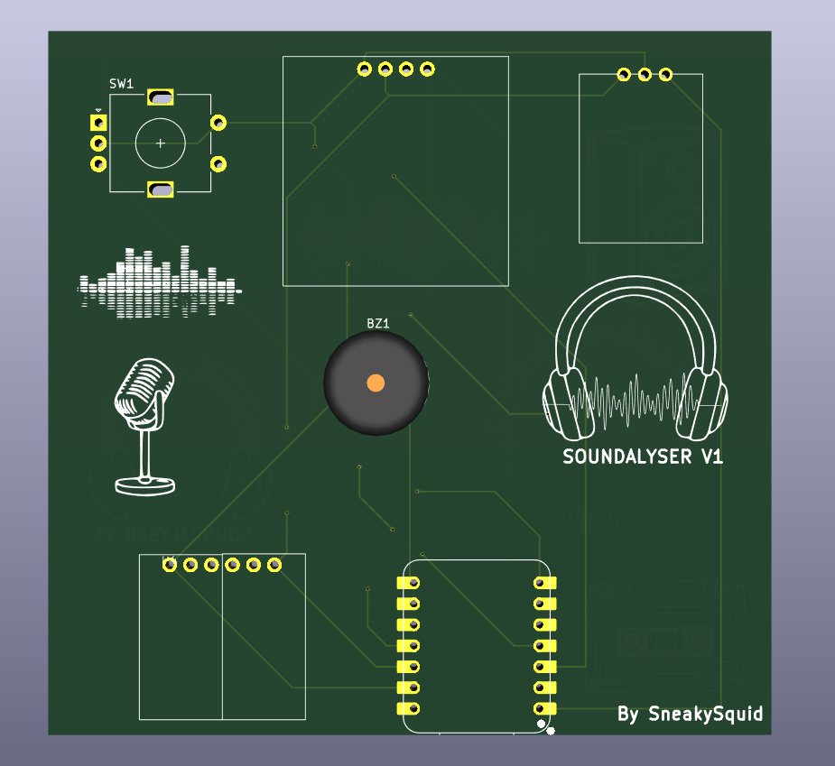

# Description  
Soundalyser is a compact portable sound monitoring device that records, logs and displays ambient noise.  

Key Features:  
5 screens navigatable using a rotary encoder:  
Waveform, sound bar chart, mood screen that compares the current average sound levels to recommended limits, a stats screen that shows number of samples taken, minimum/maximum recorded sound levels and average sound level and a screen that shows details about the SD card.

Data is logged to a csv file on an SD card every 10 minuites so that it can be saved and analysed later. A sample is taken once a second.

A buzzer beeps to alert the user if the sound level gets dangerously loud. (>900 average)

Display autosleeps and is woken by pushing in the rotary encoder.  

I made this project as an easy way to tell if the environment is too loud.

# BOM 
| Component                                       | Link                                                                                                                                               | Price (USD) |
| ----------------------------------------------- | -------------------------------------------------------------------------------------------------------------------------------------------------- | ----------- |
| 0.96 Inch OLED Display Module (SSD1306)         | [https://www.aliexpress.com/item/1005006262908701.html](https://www.aliexpress.com/item/1005006262908701.html)                                     | 3.51        |
| GY-MAX4466 Electret Microphone Amplifier Module | [https://www.aliexpress.com/item/1005006070858246.html](https://www.aliexpress.com/item/1005006070858246.html)                                     | 3.92        |
| RP2040 Seeed XIAO                               | [https://www.aliexpress.com/item/1005003682505451.html](https://www.aliexpress.com/item/1005003682505451.html)                                     | 12.11       |
| Rotary Encoder                                  | [https://www.aliexpress.com/item/1975155185.html](https://www.aliexpress.com/item/1975155185.html)                                                 | 3.62        |
| Buzzer                                          | [https://www.aliexpress.com/item/1005004883467830.html#nav-specification](https://www.aliexpress.com/item/1005004883467830.html#nav-specification) | 3.43        |
| MicroSD Card Reader                             | [https://www.aliexpress.com/item/1005006248599786.html](https://www.aliexpress.com/item/1005006248599786.html)                                     | 2.39        |
| MicroSD Card                                    | [https://www.aliexpress.com/item/1005007118463161.html](https://www.aliexpress.com/item/1005007118463161.html)                                     | 1.99        |
| M3 Screws                                       | [https://www.aliexpress.com/item/32950591394.html](https://www.aliexpress.com/item/32950591394.html)                                               | 4.89        |
| PCB (custom)                                    | [https://jlcpcb.com](https://jlcpcb.com)                                                                                                           | 1.50        |
| Case                                            | Printed with my own 3D printer                                                                                                                     | 0.00        |
 Total: 37.36 usd
